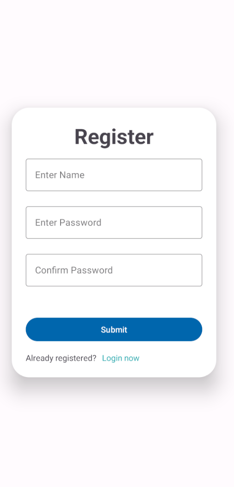

# Vocab-Wizard-App &#128293;
Entwickelt von: <b>Johannes Graf</b>

## Inhaltsverzeichnis
### 1) Setup
### 2) Anleitung
### 3) Probleme
### 4) Erfüllung der Anforderungen

## Setup
Um Ihnen Aufwand für das Setup für das Backend zu sparen habe ich mich dazu entschlossen einen Server anzumieten und das Backend dort laufen zu lassen. Das bedeutet, dass die App ohne Konfiguration eines Backends lauffähig ist. Da der Server Geld kostet und auf Grund der Abhängigkeiten von exterenen APIs würde ich mich freuen, wenn Sie mich benachrichtigen könnten, sobald die App bewertet wurde, sodass ich mir die Kosten für den Server sparen kann.<br>
Falls Sie das Backend aus irgendwelchen Gründen dennoch lokal starten möchten gebe ich im folgenden die Anleitung hierfür. Wenn Sie das nicht möchten, den nächsten Punkt einfach überspringen &#128521;.

### Anleitung für lokales Setup des Backends
<ul>
    <li> Clonen Sie den Code des Backends: <a>https://github.com/Graf-J/vocabwizard-server</a>
    <li> Erstellen Sie eine Daten mit dem Namen "<b>.env</b>" im Stammverzeichnis des Projekts (neben den Ordnern "src" und "test")
    <li> Kopieren Sie den folgenden Inhalt in die "<b>.env</b>" Datei:
</ul>

```
MONGO_URI=mongodb://mongodb:27017
JWT_SECRET=MySuperSecretJWTString
LIBRE_TRANSLATE_URL=http://libretranslate:5000
DICTIONARY_API_URL=https://api.dictionaryapi.dev
```

<ul>
    <li> Im Stammverzeichnis finden sie eine <b>docker-compose.yaml</b> Datei, über welche das Backend gestartet werden kann. Vor allem der LibreTranslate Container benötigt einen Moment bis er läuft, hierfür einfach einen Augeblick warten.
    <li> Im Source-Code der App muss unter <b>config/AppConfig.kt</b> die andere <b>SERVER_URL</b> verwendet werden.
</ul>

## Anleitung

### Login
Der Login-Screen ist der erste Screen auf den man trifft wenn man die App öffnet. Hier können Sie sich einloggen insofern sie bereits einen Account erstellt haben.<br>
<b>Wichtig: </b>Der Server verfügt über keine Zertifikate und wird über HTTP angesprochen. Ich würde also kein Passwort eingeben, welches Sie auch für andere Anwendungen benutzen.<br>
<br>
Haben Sie noch keinen Account angelegt können sie über Klicken auf <b>Register now</b> auf den Register-Screen wechseln um sich einen Account zu erstellen.

### Registrieren
Hier können Sie sich mit Name und Password einen Account anlegen.<br>
<br>
Nach der Bestätigung werden Sie auf die Übersichtsseite aller Ihrer Decks weitergeleitet.

### Deck-Übersicht
Nach der Registrierung erscheint der folgende Screen. Über den Logout Knopf rechts oben können Sie sich Ausloggen und kehren zum Login Screen zurück.<br>
<br>
Bei einem frischen Account sind noch keine Decks entalten. Mit durch das Klicken auf den Knopf welcher das Plus enthält wird auf den Screen gewechselt um eine Deck hinzufügen zu können.

### Deck-Hinzufügen
Um ein Deck hinzuzufügen muss das im folgenden dargestellten Eingabeformular ausgefüllt werden.<br>
<br>
<ul>
    <li> Die durch den Slider konfigurierte Learning Rate bestimmt, wie viele neue Karten pro Tag gelernt werden sollen.
    <li> Die App ist dazu gedacht um Englsich zu lernen. Dashalb wurden die Dropdown-Felder zur Sprachauswahl so implementiert, dass immer eine von beiden Sprachen Englisch sein muss. Dadurch ändern die Dropdown-Felder teilweise ihren Inhalt basierend auf der Eingabe im jeweils anderen Dropdown-Feld.
</ul>

### Deck-Übersicht
Nach der Bestätugnung zum Hinzufügen eines Decks kehrt man zum Deck-Übersicht-Screen zurück auf welchem nun das gerade erstellte Deck sichbar ist.<br>
<br>
<ul>
    <li> Die grüne Zahl neben dem Decknamen zeig an, wie viele neue Karten (Karten die bisher noch nie gelernt wurden) am heutigen Tage gelernt werden sollen. Diese Zahl ergibt sich aus der konfigurierten Learning Rate, den heute bereits gelernten neuen Karten und der gesamten Anzahl der Karten innerhalb des Decks.
    <li> Die blaue Zahl gib die Anzahl der Karten an, welche in der Vergangenheit bereits gelernt wurden und für welche der Algorithmus entschieden hat, dass sie heute wiederholt werden sollen.
    <li> Die insgesamt zu lernenden Karten in einem Deck für den heutigen Tag ergibt sich also aus der Summe der beiden Zahlen.
    <li> Jeden Tag Mitternachts (Zeitzone UTC) werden die zu lernenden Karten für den neuen Tag aktualisiert.
</ul>
Durch das Klicken auf den Knopf unten Links im Bild können Decks anderer Personen importiert werden.

### Deck importieren
<br>
Hier kann über das einfügen einer Deck Id ein Deck einer anderen Person importiert werden. Ich habe zu diesem Zweck ein Deck erstellt, welches Sie hierfür verwenden können. Geben sie die folgende Id in das Eingabefeld ein: <b>659800e04727537d1f3b2874</b>. Das neue Deck erscheint in der Deck Übersicht.

### Deck Übersicht
Drückt man lange auf ein Deck erscheint ein Menü mit Operationen, welche auf ein Deck ausgeübt werden können.<br>
<br>
Im folgenden werden diese Operationen sequenziell von oben nach unten erläutert.

### Add Card
Abhängig davon, mit welchen Sprachen das Deck bei der Erstellung konfiguriert wurde, muss hier ein Wort in der entsprechenden Sprache eingegeben werden. Die App ist (oftmals) im Stande sowohl die Übersetzung als auch andere Eigenschaften des Wortes selbständig zu generieren.<br>
<br>
Nach Bestätigung des Wortes erscheint ein Toast, welcher darüber informiert, dass das Wort erfolgreich hinzugefügt wurde. Der Screen wird nicht verlassen, um es für den Nutzer angenehm zu gestalten mehrere Wörter nacheinander in das Deck einzupflegen.

### Copy Id
Durch einen Klick auf Copy Id wird die Id des Decks in die Zwischenablage kopiert. Diese Id kann wie bereits gesehen von anderen Nutzern verwendet werden und das Deck zu importieren. Das importieren eines eigenen Decks wird von der App abgelehnt, zu testen müssten Sie somit mit einem neuen Account registrieren um das Deck zu importieren.

### Statistics
Hier kann eingesehen werden, wie gut Sie die im Deck enthaltenen Karten beherschen. Zu beginn wird der Pie Chart noch ziemlich langweilig aussehen, da Sie noch keine Karten gelernt haben. Wenn sie die App über eienen längeren Zeitraum nutzen würden, würde sich jedoch eine Statistik ähnlich zum folgenden Screen ergeben.<br>
<br>

### Update Deck
Hier kann der Name und die Leraning Rate ihres Decks aktualisiert werden. Die gewählten Sprachen können nicht mehr abgeändert werden und werden hier nur zu Informationszwecken abgebildet.<br>
<br>
<b>Hinweis: </b>Sie könnten bei dem in einem vorangeganben Schritt die Learning Rate anpassen und betrachten, wie sich die zu lernenden Karten in der Deckübersicht entsprechend ändert.

### Reverse Deck
Durch das Klicken auf <b>Reverse Deck</b> wird ein neues Deck erzeugt, welches die Übersetzungsrichtung der Wörter vertauscht. Das bedeutet, wenn vorher die Wörter von Deutsch in Englisch übersetzt wurden werden die Karten nun von Englisch in Deutsch übersetzt.<br>

### Delete Deck
Durch das Klicken auf <b>Delete Deck</b> und dem Bestätigen des darauf folgenden Dialogs wird das gewählte Deck und dessen Karten gelöscht.

### Karten lernen
Durch das einfache Klicken auf ein Deck in der Deck-Übersicht können die Karten welche vom Algorithmus für diesen Tag zugewiesen wurden gelernt werden. Im ersten Schritt wird die Vorderseite der Karte angezeigt. Der Nutzer muss versuchen das Wort in die entsprechend andere Sprache zu übersetzen.<br>
<br>
Klickt der Nutzer auf die Karte, so dreht sich diese um und die Übersetzung kommt zusammen mit anderen hilfreichen Informationen zum Vorschein. Dieser Screen enthält sowohl die Übersetzung als auch andere hilfreiche Information über die Vokabel.<br>
<b>Wichtig: </b>
<ul>
    <li> Wird für ein Wort keine Übersetung gefunden wird das Wort welches übersetzt werden soll an Stelle des übersetzten Wortes angezeigt. Deshalb ist auch der Knopf zum löschen hier angebracht, dass die Karten mit falschen Informationen sofort aus dem Deck entfernt werden können.
    <li> Werden für ein Wort keine Definitionen, Beispiele, Synonyme oder Akronyme gefunden wird in der entsprechenden Sektion nichts angezeigt.
</ul>
<br>
<ul>
    <li> Abhängig davon wie gut Sie die Vokabel übersetzen konnten, können Sie auf den entsprechenden Knopf drücken. Beim Klicken auf Easy, Good oder Hard ist die Karte für den heutigen Tag gelernt, die Karte wird aus dem Deck für den heutigen Tag entfernt. Der Algorithmus ordnet Karte abhängig davon welchen Knopf Sie gedrückt haben und wie Sie die Karte bereits in der Vergangenheit gelernt haben so ein, dass sie mit einem Abstand von einigen Tagen wieder in das Deck zum lernen eingereiht wird. Lernen Sie eine Karte beispielsweise zum ersten man und klicken auf den Knopf "Hard", so wird die Vokabel am nächsten Tag nochmals abgefragt.
    <li> In der rechten oberen Ecke der Karte ist ein Knopf abgebildet, wodurch die Karte durch eine Bestätigung im darauf folgenden Dialog gelöscht werden kann. Der Knopf ist bewusst hier angelegt, da teilweise keine sinnvollen Übersetzungen für ein Wort gefunden werden können und die Karte somit direkt gelöscht werden kann wenn es dem Nutzer das erste mal auffällt.
</ul>

## Probleme
Für die App an sich sind mir aktuell keine Probleme bekannt. Das einzige Problem ist, dass teilweise keine sinnvollen oder gar keine Übersetzung für ein Wort gefunden werden kann. Das ist jedoch ein Problem welches weder mit der App noch mit dem zugehörigen Backend zu tun hat, sondern mit den verwendeten externen APIs zusammenhängt. Grundlegend kann man sagen, dass die Übersetzung und zugehörigen Informationen präziser sind, wenn man von Englisch in eine andere Sprache übersetzt als andersherum, da hier ein Übersetzungsschritt entfällt. Ich habe mich dazu entschieden keine kostenpflichtigen externen API zu verwenden die möglicherweise bessere Ergebnisse liefern. Ich hatte die Überlegung die App zu ändern, dass der Nutzer die Karten selbst beschriften muss, mir ist jedoch aufgefallen dass ich die selbständige Übersetzung des Wortes und das finden zusätzlicher Informationen explizit in den Anforderungen angegeben habe und habe deshalb nichts verändert. In Zukunft habe ich den Plan diese Option noch zusätzlich einzubauen. Für die Abgabe war das aus Zeitgründen jedoch nicht möglich (es war ja auch in keinster Weise in den Anforderungen definiert).

## Erfüllung der Anforderungen
### Grundanforderungen (11_Projekt.pdf)
- [x] Technisches: Kotlin, minSDK 28 (Android 9.0)
- [x] ViewBinding aktiviert
- [x] MVVM-Architektur
- [x] Single-Activity-Approach (Fragments) -> Mit Navgraph realisiert
- [x] Navigationskomponente (z.B. Bottom Nav Bar oder Navigation Drawer oder auch Nav Graph) -> Navgraph
- [x] Individuelles Design (skalierbares Layout, eigene Farben, App-Icon, …) -> Für verschiedene Bildschirmgrößen kompatibel
- [x] Mind. ein "Feature", das über Fundamentals hinaus geht -> Nav Graph und selbsgebaute Animation für Karte umdrehen
- [ ] Transparente Aufgabenverteilung -> Ich war alleine, deshalb keine Aufgabenverteilung
- [x] Klare Anweisungen zur Ausführung des Backends
- [x] Dokumentation von Known Issues & Lösungsversuche

### Pflichtanforderungen (Google Docs)
- [x] App kann von Englisch in Deutsch, Französisch, Italienisch und Spanisch übersetzen und andersherum
- [x] Karteikarten werden in Decks organisiert
- [x] Zum Hinzufügen einer Karteikarte muss nur das Wort eingegeben werden, die Übersetzung, sowohl hilfreiche Informationen wie z.B. Aussprache, Definition, Beispiele oder Synonyme werden selbständig für die englische Sprache generiert
- [x] Nutzer sollen sich Registrieren und Anmleden können, um Geräteunabhängig auf die Karteikarten zugreifen zu können
- [x] Der Nutzer kann pro Stapel konfigurieren, wie viele neue Karteikarten er pro Tag lernen möchte
- [x] Ein Algorithmus Berechnet auf Basis der Eingaben des Nutzers nach welchem Zeitraum die Karteikarte wieder zu wiederholen ist

### Optionale Anforderungen (Google Docs)
- [x] Die Karten eines Stapels können “umgedreht” werden, sodass wenn zuvor die Lernrichtung deutsch -> englisch war sie danach englisch -> deutsch ist
- [x] Kartendecks anderer Nutzer können über den Namen importiert werden (wurde mit ID anstatt Name implementiert)
- [x] Ansprechendes Design (meiner Meinung nach ist das Design ansprechend &#128516; Ich habe auch verschiedene Farben für die unterschiedlichen Themes eingesetzt etc.)

### Bonus Features
- [x] Der Nutzer kann Statistiken für jedes Deck einsehen, um sich einen Überblick über die gelernten Karten zu verschaffen
